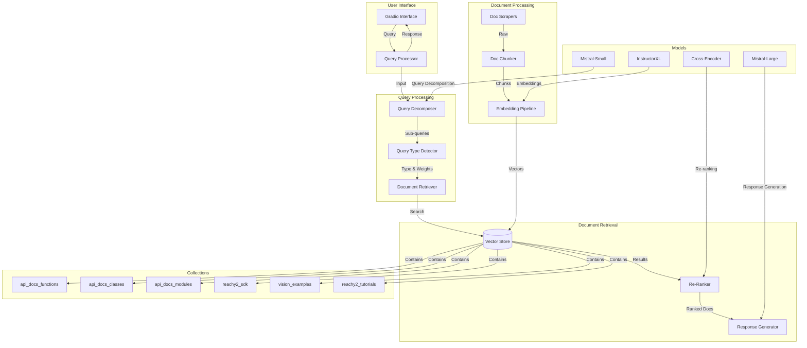

# Reachy2 Expert Agent - System Architecture

## Component Details

### 1. User Interface Layer
- **Gradio Interface**: Web-based chat interface
- **Query Processor**: Manages query flow and response generation
- **Progress Tracking**: Real-time status updates

### 2. Query Processing Layer
- **Query Decomposer**: Breaks down complex queries
- **Query Type Detector**: Identifies query category
- **Collection Weighting**: Dynamic collection importance

### 3. Document Retrieval Layer
- **Vector Store**: ChromaDB-based document storage
- **Re-Ranker**: Cross-encoder based re-ranking
- **Response Generator**: Context-aware response synthesis

### 4. Document Processing Layer
- **Doc Scrapers**: Multi-source documentation collection
- **Doc Chunker**: Semantic document segmentation
- **Embedding Pipeline**: Vector generation and storage

### 5. Collections Layer
- **api_docs_functions**: Function documentation
- **api_docs_classes**: Class documentation
- **api_docs_modules**: Module documentation
- **reachy2_sdk**: SDK examples
- **vision_examples**: Vision system examples
- **reachy2_tutorials**: Tutorial content

### 6. Model Layer
- **Mistral-Small**: Query decomposition
- **InstructorXL**: Document embeddings
- **Cross-Encoder**: Result re-ranking
- **Mistral-Large**: Response generation

## Data Flow

1. **Query Input**
   - User submits query through Gradio interface
   - Query processor initiates pipeline

2. **Query Analysis**
   - Query decomposer breaks down complex queries
   - Query type detector determines category
   - Collection weights are assigned

3. **Document Retrieval**
   - Vector store searches across collections
   - Results are weighted by collection importance
   - Cross-encoder re-ranks results

4. **Response Generation**
   - Context is assembled from top results
   - Response is generated with code examples
   - Response is formatted and returned

5. **Continuous Updates**
   - Documentation is regularly scraped
   - New content is processed and embedded
   - Vector store is updated

## System Requirements

- Python 3.8+
- ChromaDB
- Sufficient storage for vector database
- Required API keys
- Memory for processing large documents 