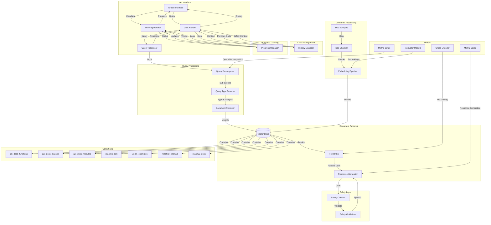

# Reachy2 Expert Agent - System Architecture



## Component Details

### 1. User Interface Layer
- **Gradio Interface**: Web-based chat interface with message UI
- **Chat Handler**: Manages conversation flow and history
- **Query Processor**: Coordinates query processing pipeline
- **Thinking Handler**: Manages real-time progress updates
- **Progress Tracking**: Real-time status and timing updates

### 2. Chat Management Layer
- **History Manager**: Maintains conversation context
- **Context Tracking**: Links related queries and responses
- **Code Memory**: Tracks previously shared code examples
- **Safety Context**: Maintains safety guidelines across conversation

### 3. Query Processing Layer
- **Query Decomposer**: Breaks down complex queries
- **Query Type Detector**: Identifies query category
- **Collection Weighting**: Dynamic collection importance

### 4. Document Retrieval Layer
- **Vector Store**: ChromaDB-based document storage
- **Re-Ranker**: Cross-encoder based re-ranking
- **Response Generator**: Context-aware response synthesis

### 5. Progress Tracking Layer
- **Progress Manager**: Real-time status updates
- **Timing Information**: Duration tracking for each step
- **Log Management**: Detailed operation logging
- **Status Updates**: Live progress indicators

### 6. Safety Layer
- **Safety Checker**: Validates responses against guidelines
- **Safety Guidelines**: Category-specific safety rules
- **Validation Rules**: Movement, gripper, vision safety
- **Context Tracking**: Maintains safety context across chat

### 7. Document Processing Layer
- **Doc Scrapers**: Multi-source documentation collection
- **Doc Chunker**: Semantic document segmentation
- **Embedding Pipeline**: Vector generation and storage

### 8. Collections Layer
- **api_docs_functions**: `data/external_docs/api_docs_functions.json`
- **api_docs_classes**: `data/external_docs/api_docs_classes.json`
- **api_docs_modules**: `data/external_docs/api_docs_modules.json`
- **reachy2_sdk**: `data/external_docs/reachy2_sdk.json`
- **vision_examples**: `data/external_docs/vision_examples.json`
- **reachy2_tutorials**: `data/external_docs/reachy2_tutorials.json`
- **reachy2_docs**: `data/external_docs/reachy2_docs.json`

### 9. Model Layer
- **Mistral-Small**: Query decomposition
- **Instructor Models**: Document embeddings
-   - InstructorXL (default): Highest quality, slower (768d)
-   - InstructorLarge: Good balance of speed/quality (768d)
-   - InstructorBase: Fastest, may sacrifice some quality (768d)
- **Cross-Encoder**: Result re-ranking
- **Mistral-Large**: Response generation

## Message Format

```json
{
    "role": "assistant",
    "content": "Message content",
    "metadata": {
        "title": "Step Title",
        "status": "pending/done",
        "log": "Detailed progress information",
        "duration": 0.0
    }
}
```

## Progress Tracking

Each operation includes:
1. Status indicators (pending/done)
2. Timing information (duration in seconds)
3. Detailed logs of sub-steps
4. Progress updates in real-time

## Data Flow

1. **Chat Initialization**
   - User starts conversation through interface
   - Chat handler initializes history
   - Safety context is established

2. **Query Processing**
   - Chat handler provides conversation context
   - Query decomposer breaks down complex queries
   - Query type detector determines category
   - Collection weights are assigned

3. **Progress Updates**
   - Real-time status updates for each step
   - Duration tracking for operations
   - Detailed logging of sub-tasks
   - Live progress indicators

4. **Document Retrieval**
   - Vector store searches across collections
   - Results weighted by collection importance
   - Cross-encoder re-ranks results
   - Context assembled with history

5. **Safety Validation**
   - Response draft generated
   - Safety checker validates content
   - Guidelines appended based on context
   - Previous safety context considered

6. **Response Generation**
   - Context assembled from multiple sources
   - Code examples generated with imports
   - Safety guidelines integrated
   - Response formatted for chat

7. **Continuous Updates**
   - Documentation regularly scraped
   - New content processed and embedded
   - Vector store updated
   - Safety guidelines refined

## System Requirements

- Python 3.8+
- ChromaDB
- Sufficient storage for vector database
- Required API keys
- Memory for processing large documents
- Persistent storage for chat history 

## Project Structure

```
reachy2_expert_agent/
├── src/                    # Source code
│   ├── __init__.py
│   ├── chatbot.py         # Main chatbot implementation
│   └── utils/             # Utility modules
│       ├── config.py      # Configuration settings
│       ├── rag_utils.py   # RAG pipeline utilities
│       ├── db_utils.py    # Database operations
│       └── embedding_utils.py  # Embedding generation
├── tests/                 # Test suite
│   ├── __init__.py
│   ├── conftest.py       # Test configuration
│   ├── integration/      # Integration tests
│   └── unit/            # Unit tests
├── tools/                # Utility scripts
│   ├── chunk_documents.py    # Document chunking
│   ├── update_vectordb.py    # Vector database updates
│   ├── scrape_sdk_docs.py    # SDK documentation scraper
│   ├── scrape_vision_docs.py # Vision documentation scraper
│   ├── scrape_tutorials.py   # Tutorials scraper
│   ├── scrape_reachy2_docs.py # Main documentation scraper
│   ├── analyze_coverage.py   # Coverage analysis
│   └── evaluate_retrieval.py # Retrieval evaluation
├── data/                  # Data directory
│   ├── raw_docs/         # Raw documentation
│   ├── external_docs/    # Processed documentation
│   ├── vectorstore/      # Vector database
│   └── cache/           # Temporary data
├── docs/                 # Project documentation
├── requirements.txt      # Dependencies
└── README.md            # Project overview
```

## Environment Setup

```bash
# Required environment variables (.env file)
MISTRAL_API_KEY=your_mistral_api_key    # Required for LLM operations
DEBUG=false                             # Enable/disable debug mode
```

## Development Workflow

1. **Environment Setup**
   ```bash
   make venv              # Create virtual environment
   source venv/bin/activate
   pip install -r requirements.txt
   ```

2. **Code Quality**
   ```bash
   make format           # Format code
   make lint            # Run linters
   make test            # Run tests
   ```

3. **Documentation Pipeline**
   ```bash
   make scrape          # Collect documentation
   make chunk           # Process into chunks
   make update-db       # Update vector store
   ```

4. **Continuous Integration**
   - Pre-commit hooks for code quality
   - Automated tests on push
   - Documentation updates
   - Vector store validation

## Data Management

1. **Raw Documentation** (`data/raw_docs/`)
   - Cloned repositories
   - Extracted documentation
   - Temporary processing files

2. **External Documentation** (`data/external_docs/`)
   - Processed JSON files
   - Chunked documentation
   - Indexed content

3. **Vector Database** (`data/vectorstore/`)
   - ChromaDB collections
   - Embedding vectors
   - Metadata storage

4. **Cache** (`data/cache/`)
   - Temporary processing data
   - Model caches
   - Intermediate files 