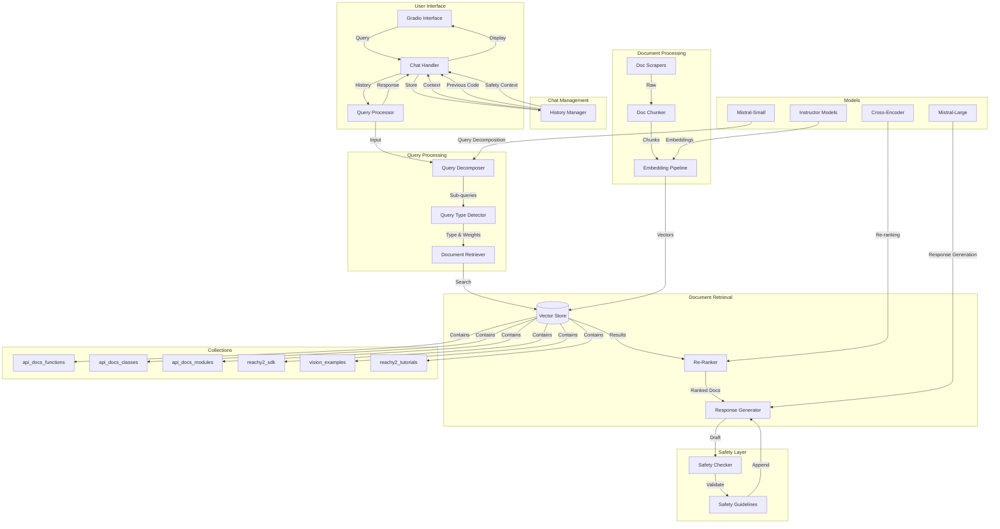

# Reachy2 Expert Agent - System Architecture

## Component Details

### 1. User Interface Layer
- **Gradio Interface**: Web-based chat interface
- **Chat Handler**: Manages conversation flow and history
- **Query Processor**: Coordinates query processing pipeline
- **Progress Tracking**: Real-time status updates

### 2. Chat Management Layer
- **History Manager**: Maintains conversation context
- **Context Tracking**: Links related queries and responses
- **Code Memory**: Tracks previously shared code examples
- **Safety Context**: Maintains safety guidelines across conversation

### 3. Query Processing Layer
- **Query Decomposer**: Breaks down complex queries
- **Query Type Detector**: Identifies query category
- **Collection Weighting**: Dynamic collection importance

### 4. Document Retrieval Layer
- **Vector Store**: ChromaDB-based document storage
- **Re-Ranker**: Cross-encoder based re-ranking
- **Response Generator**: Context-aware response synthesis

### 5. Safety Layer
- **Safety Checker**: Validates responses against guidelines
- **Safety Guidelines**: Category-specific safety rules
- **Validation Rules**: Movement, gripper, vision safety
- **Context Tracking**: Maintains safety context across chat

### 6. Document Processing Layer
- **Doc Scrapers**: Multi-source documentation collection
- **Doc Chunker**: Semantic document segmentation
- **Embedding Pipeline**: Vector generation and storage

### 7. Collections Layer
- **api_docs_functions**: Function documentation
- **api_docs_classes**: Class documentation
- **api_docs_modules**: Module documentation
- **reachy2_sdk**: SDK examples
- **vision_examples**: Vision system examples
- **reachy2_tutorials**: Tutorial content

### 8. Model Layer
- **Mistral-Small**: Query decomposition
- **Instructor Models**: Document embeddings
-   - InstructorXL (default): Highest quality, slower (768d)
-   - InstructorLarge: Good balance of speed/quality (768d)
-   - InstructorBase: Fastest, may sacrifice some quality (768d)
- **Cross-Encoder**: Result re-ranking
- **Mistral-Large**: Response generation

## Data Flow

1. **Chat Initialization**
   - User starts conversation through interface
   - Chat handler initializes history
   - Safety context is established

2. **Query Processing**
   - Chat handler provides conversation context
   - Query decomposer breaks down complex queries
   - Query type detector determines category
   - Collection weights are assigned

3. **Context Management**
   - Previous queries and responses tracked
   - Code examples maintained for reference
   - Safety guidelines accumulated
   - Conversation flow preserved

4. **Document Retrieval**
   - Vector store searches across collections
   - Results weighted by collection importance
   - Cross-encoder re-ranks results
   - Context assembled with history

5. **Safety Validation**
   - Response draft generated
   - Safety checker validates content
   - Guidelines appended based on context
   - Previous safety context considered

6. **Response Generation**
   - Context assembled from multiple sources
   - Code examples generated with imports
   - Safety guidelines integrated
   - Response formatted for chat

7. **Continuous Updates**
   - Documentation regularly scraped
   - New content processed and embedded
   - Vector store updated
   - Safety guidelines refined

## System Requirements

- Python 3.8+
- ChromaDB
- Sufficient storage for vector database
- Required API keys
- Memory for processing large documents
- Persistent storage for chat history 